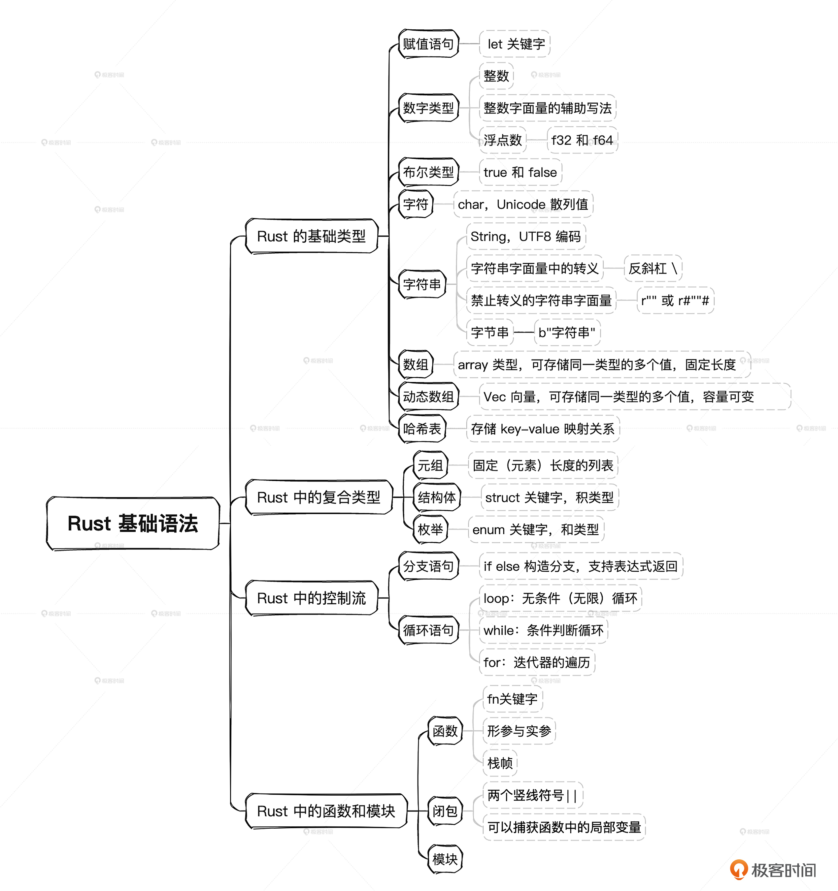

# Rust 学习
## 常用指令
执行 .rs 文件
```api
方式一：
// 编译 .rs 文件
// 执行编译后的 .rs 文件
rustc *.rs

方式二：
cargo-script 是一个可以让您运行 Rust 脚本而无需显式编译的工具。
cargo install cargo-script

cargo script .\*.rs
```
## basictype 基础类型
## complextype 复合类型
## controlflow 控制流
## funcmodule 函数与模块

